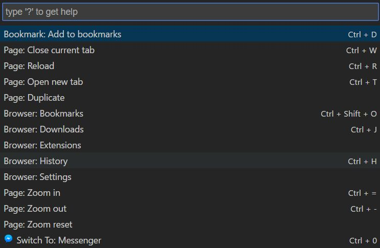

# Surfable

Surfable is quick command pallete extension for chrome. It's heavly inspired
by command pallete from Sublime Text, Atom and VS Code (thank VS Code for design).



## 1. Development

To check all TODOs, go to [TODO.md](./TODO.md)

### 1.1. Overview

Surfable is mono repo using [lernajs](https://github.com/lerna/lerna) for packages
listed bellow. If you never heard about monorepo, it means that single repository
holds several subrepositories. Every directory found in `/packges` it's own repository
with `package.json` included in.

Morepo is mostly helpfull when you're dealing with Typescript and shared interfaces
between several subprojects. In monorepo it's easy to define your *subproject* with
shared types, which other subprojects will use. Just add that *subproject-name* to
your `package.json` and lerna will handle everything (installing dependencies and
symlinks) for you.

When you already cloned surfable repository, start with bootstraping project, instead
of doing `npm install` in every subrepository, use `lerna bootstrap`. So, make sure
that lerna is installed globaly `npm install lerna -g`

```bash
git clone https://github.com/dderevjanik/surfable
lerna bootstrap
```

Lerna bootstrap will make `npm install` for you in every subrepository and it'll
also create symlinks for shared dependencies.

### 1.2. Lerna scripts

Lerna offers scripts to be executed right from working directory. Sript will be
executed in each subprojects. That means you can lint all your projects from working
directory without changing directory or writing absolute path to subproject.

Instead of using `npm run script` use `lerna run script`

Available lerna scripts:

`lerna run lint` - lint all subprojects using tslint

### 1.3. Packages

Surfable consist from several subpackages listed bellow. Most of packages are named
after chrome extension's achitecture. It's highly recommended to read about
[chrome extension's architecture](https://developer.chrome.com/extensions/overview#arch)
before starting contributing to this project.

#### 1.3.1. Background

This is main heart of Surfable app. All events passing to command line headings
to background. Background is always running, so it's listening to commands from
popup or client.

#### 1.3.2. Popup

Popup is frontend for popup, when user clicks on top-right icon in chrome browser.

#### 1.3.3. Content

Content is script, which is executed on every page user visits.

#### 1.3.4. Common

Used to share interfaces, types a common data between subprojects. Events (redux's
actions), which are used among subprojects are stored in common to avoid type
errors and common javascript mistakes.

## 2. Examples

### 2.1. Custom Command

```typescript
// packages/popup/src/data/Commands.ts
const customCommand: ICommand = {
    type: COMMAND.SIMPLE,
    cat: CAT.PAGE, text: 'Open new tab', desc: 'Ctrl + T',
    action: { type: MESSAGE.TAB_NEW, url: '', targe: ETarget.BACKGROUND }
},
```

## 3. Credits

- [vscode](https://github.com/Microsoft/vscode) for providing such a beautifull IDE and best implementation of quickpanel/command palette.
